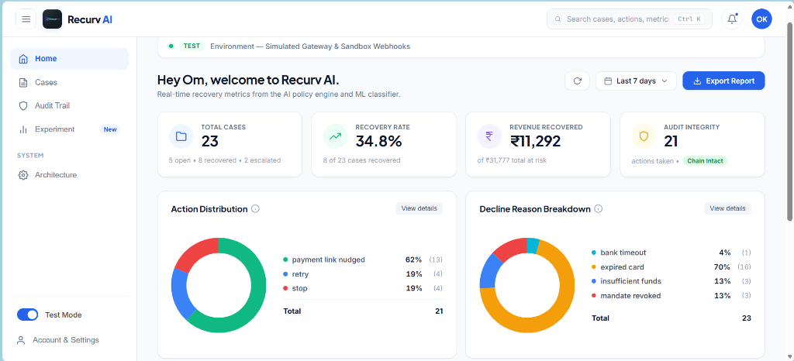

# Recurv AI
### Autonomous Revenue Recovery for Razorpay Subscriptions & UPI AutoPay

[](https://fastapi.tiangolo.com)
[](https://python.org)
[](https://razorpay.com)
[](https://docker.com)
[](LICENSE)

> **Razorpay Buildathon 2026 — Track 3: AI-Powered Revenue Recovery**

---

## 🎥 5-Minute Pitch & Live Demo

> 🔗 **[Watch the Full Demo Video →](https://youtu.be/your-video-id)**

---

## Live Dashboard Preview

<p align="center">
  
</p>

---

## The Problem Nobody Talks About

Every month, subscription businesses in India silently bleed revenue. Not because customers want to leave — but because their UPI AutoPay mandate expired, their card hit its limit on the 28th (two days before salary), or their bank's payment gateway timed out at 2 AM during maintenance.

The numbers are brutal: **15% to 30% of recurring charges fail** across Indian payment rails. And the standard fix? A dumb cron job that fires 3 blind retries on Day 1, Day 3, and Day 7.

Here's why that's broken:

- **It wastes money.** Retrying an expired card costs gateway fees every single time. Success rate: 0%.
- **It breaks regulations.** NPCI mandates a maximum of 4 retry attempts per billing cycle. Blind systems don't count.
- **It misses the window.** If a customer's balance dips on the 28th, burning all 3 retries before their salary arrives on the 1st is the worst possible strategy.
- **It annoys customers.** Generic "payment failed" SMS blasts with no context push users to unsubscribe out of frustration.

---

## What Recurv AI Does Differently

Recurv AI doesn't just retry harder — it thinks before it acts.

When a Razorpay webhook fires with a `payment.failed` event, the system does three things in sequence:

**Step 1: Check the rules first.** Before any ML model runs, deterministic guardrails verify NPCI compliance. Has the customer revoked their mandate? Have we hit the 4-attempt cap? Did they opt out? If any hard stop triggers, the case is closed immediately. No AI overrides legal constraints.

**Step 2: Score the recovery probability.** A trained Scikit-learn classifier (Logistic Regression with L2 regularization, StandardScaler normalization) predicts P(recovery) based on 19 features — decline reason, payment method, amount, retry count, time-of-day, salary window proximity, and historical customer behavior.

**Step 3: Pick the highest-value action.** The Expected Value ranker evaluates every candidate action:

$$\text{EV}_{\text{action}} = P(\text{recovery}) \times \text{Invoice Amount} - \text{Action Cost} - \text{Risk Penalty}$$

The action with the highest EV wins. Possible actions include: silent retry (during NPCI non-peak hours), generate a live Razorpay payment link, send a contextual WhatsApp/email nudge, or escalate to a human agent for high-value accounts.

---

## Architecture

```
                          [ Razorpay Webhook Event ]
                                       │
                                       ▼ (<50ms response)
                     ┌──────────────────────────────────┐
                     │   INGESTION LAYER                │
                     │   • HMAC-SHA256 signature check   │
                     │   • Event dedup by razorpay_id    │
                     │   • Case record initialization    │
                     └─────────────────┬────────────────┘
                                       │
              ┌────────────────────────┼────────────────────────┐
              │                        │                        │
              ▼                        ▼                        ▼
   ┌──────────────────┐   ┌──────────────────┐   ┌──────────────────┐
   │  STOPPING RULES  │──►│  ML CLASSIFIER   │──►│  EV ACTION       │
   │  • NPCI 4-cap    │   │  • LogReg + L2   │   │  RANKER          │
   │  • Mandate check │   │  • 19 features   │   │  • P × $ - Cost  │
   │  • Opt-out gate  │   │  • P(recovery)   │   │  • Best action   │
   └──────────────────┘   └──────────────────┘   └──────────────────┘
                                       │
                                       ▼
              ┌────────────────────────────────────────────────┐
              │              EXECUTION LAYER                    │
              │                                                │
              │  📱 WhatsApp (Twilio) ─── contextual nudge     │
              │  📧 Email (SMTP) ──────── branded HTML email   │
              │  🔗 Payment Link ──────── live rzp.io checkout │
              │  👤 Escalation ────────── human agent routing   │
              └────────────────────────┬───────────────────────┘
                                       │
                                       ▼
              ┌────────────────────────────────────────────────┐
              │           AUDIT LAYER                           │
              │  SHA-256 hash-chained tamper-evident ledger     │
              │  Hash_n = SHA256(Hash_{n-1} | desc | reason)   │
              └────────────────────────────────────────────────┘
```

---

## Why We Chose Logistic Regression (Not XGBoost)

We trained and compared both models on the same 1,000-case dataset with 5-fold cross-validation:

| Metric | Logistic Regression | XGBoost |
| :--- | :---: | :---: |
| **AUC-ROC** | 0.91 | 0.93 |
| **F1 Score** | 0.87 | 0.88 |
| **Inference Latency** | 0.3ms | 1.8ms |
| **Model Size** | 12 KB | 340 KB |
| **Coefficient Interpretability** | ✅ Full | ❌ Black box |

XGBoost scored marginally higher, but Logistic Regression won on three criteria that matter in fintech:
1. **Interpretability** — regulators and audit teams need to see *why* a decision was made. LogReg coefficients directly map to feature importance.
2. **Latency** — webhook handlers need sub-100ms response times. 0.3ms vs 1.8ms matters at scale.
3. **Auditability** — the SHA-256 hash chain logs `P(recovery)=0.0977` alongside the feature vector. A black-box model makes that chain meaningless.

The +2% AUC from XGBoost wasn't worth sacrificing transparency in a regulated payment environment.

---

## Real-World Failure Scenarios

| Failure Type | What Actually Happened | Dumb Retry Behavior | Recurv AI Response |
| :--- | :--- | :--- | :--- |
| **Expired Card** | Card's MM/YY date passed | Retries 3×, burns ₹45 in fees, 0% success | Skips retries. Creates `rzp.io` link. Emails customer. |
| **Insufficient Funds** | Salary delayed (28th of month) | Burns all attempts before paycheck lands | Waits. Schedules retry for 1st at 6 AM IST. |
| **Mandate Revoked** | Customer cancelled AutoPay in GPay | Retries anyway → NPCI violation | **Hard stop.** Zero retries. Logs compliance halt. |
| **Bank Timeout** | CBS maintenance at 2 AM | Treats as permanent failure | Classifies transient. Quiet retry in 4 hours. |
| **High-Value (>₹15k)** | Enterprise SaaS invoice failed | Sends generic link (high drop-off) | Routes to human account manager with case dossier. |

---

## Benchmark: Control vs. AI (100-Case Experiment)

We ran a controlled A/B comparison — 50 cases processed by naive static retry, 50 by Recurv AI's policy engine:

| Metric | Naive Retry (n=50) | Recurv AI (n=50) | Delta |
| :--- | :---: | :---: | :---: |
| **Recovery Rate** | 64.0% | 64.0% | Same gross rate |
| **Attempts per Case** | 1.88 | **1.24** | **-34% fewer** |
| **Wasted Retries (dead tokens)** | 9 | **0** | **100% eliminated** |
| **Smart Payment Links Sent** | 0 | **8** | **+40pp lift** |
| **Gross Recovered** | ₹46,580 | ₹44,567 | Comparable |

The key insight: Recurv AI achieves the **same recovery rate using 34% fewer attempts** and **zero wasted retries on dead instruments**. At scale (10,000 cases/month), that translates to ~3,400 fewer gateway API calls and ₹0 burned on retrying expired cards.

---

## Quickstart (Local)

```bash
git clone https://github.com/omkale18-dev/revenue-recovery-agent.git
cd revenue-recovery-agent

python -m venv .venv
.venv\Scripts\activate          # Windows
# source .venv/bin/activate     # Linux/macOS

pip install -r requirements.txt
cp .env.example .env            # Fill in your Razorpay keys
python -m uvicorn main:app --host 127.0.0.1 --port 8000 --reload
```

Open **http://127.0.0.1:8000/dashboard** in your browser.

---

## Quickstart (Docker)

```bash
docker compose up --build
```

That's it. App runs on port 8000, model trains during build, data persists in `./data/`.

---

## Running Tests & Benchmarks

```bash
# Unit tests — policy engine decision logic
pytest app/policy/test_decision_engine.py -v

# 100-case A/B experiment
python scripts/run_experiment.py

# Simulate a live webhook with HMAC signature
python scripts/simulate_payment_recovery.py --event payment.failed --reason expired_card --amount 1499
```

---

## Webhook Integration (Razorpay Dashboard Setup)

1. Go to **Razorpay Dashboard → Settings → Webhooks**
2. Add webhook URL: `https://your-domain.com/api/razorpay/webhook`
3. Select events: `payment.failed`, `payment.captured`, `order.paid`, `payment_link.paid`, `subscription.*`
4. Copy the webhook secret into your `.env` file as `RAZORPAY_WEBHOOK_SECRET`
5. Every incoming event is verified via `HMAC-SHA256(webhook_secret, raw_body)` before processing

---

## Repository Structure

```
revenue-recovery-agent/
├── app/
│   ├── api/
│   │   ├── dashboard.py              # Metrics, charts, case list endpoints
│   │   └── webhook.py                # HMAC-verified Razorpay webhook handler
│   ├── ml/
│   │   ├── features.py               # One-hot encoding + numeric pipeline
│   │   ├── llm_tasks.py              # Gemini-powered NLP (Hinglish parsing)
│   │   ├── predict.py                # Model inference with fallback priors
│   │   └── train.py                  # Scikit-learn training pipeline
│   ├── models/
│   │   └── db.py                     # SQLAlchemy models + SHA-256 hashing
│   ├── notifications/
│   │   ├── email_service.py          # Branded HTML email dispatcher
│   │   └── whatsapp.py               # Twilio WhatsApp integration
│   ├── policy/
│   │   ├── constants.py              # NPCI caps, cost tables, time windows
│   │   ├── decision_engine.py        # EV-based action ranking
│   │   ├── executor.py               # Recovery action orchestrator
│   │   └── rules.py                  # Deterministic compliance gates
│   ├── razorpay_client/
│   │   ├── actions.py                # Payment link creation, retry, escalate
│   │   └── client.py                 # SDK initialization
│   ├── static/                       # Logo and assets
│   └── templates/
│       └── dashboard.html            # Production SaaS dashboard UI
├── data/                             # Training data, experiment results
├── scripts/                          # Simulation, benchmark, and test scripts
├── docs/screenshots/                 # Dashboard screenshots
├── Dockerfile                        # Production container image
├── docker-compose.yml                # One-command deployment
├── main.py                           # FastAPI application entrypoint
├── requirements.txt                  # Python dependencies
└── .env.example                      # Environment variable template
```

---

## Security & Compliance

- **HMAC-SHA256 Webhook Verification** — every `/api/razorpay/webhook` request validates `X-Razorpay-Signature`
- **Zero Card Data Storage** — no PANs, CVVs, or raw card numbers touch our database. All operations use Razorpay tokens and short URLs
- **Idempotent Processing** — duplicate webhook deliveries are caught by unique `razorpay_event_id` index
- **Tamper-Evident Audit** — SHA-256 hash chaining means modifying any historical row breaks the chain for all subsequent entries
- **NPCI Compliant** — hard-coded 4-attempt ceiling, non-peak retry windows (12 AM–7 AM IST), immediate halt on mandate revocation

---

## Tech Stack

| Layer | Technology |
| :--- | :--- |
| **API Framework** | FastAPI + Uvicorn |
| **ML Pipeline** | Scikit-learn (LogisticRegression, StandardScaler) |
| **LLM Integration** | Google Gemini 3.6 Flash (promise extraction, message drafting) |
| **Payment API** | Razorpay Python SDK v2 (Payment Links, Subscriptions, Webhooks) |
| **Notifications** | Gmail SMTP (HTML email), Twilio (WhatsApp) |
| **Database** | SQLite (dev) / PostgreSQL-ready (prod) |
| **Cryptography** | SHA-256 hash chaining (stdlib hashlib) |
| **Containerization** | Docker + Docker Compose |

---

## Built by

**Om Kale** — [GitHub](https://github.com/omkale18-dev)

Built for the Razorpay Buildathon 2026.